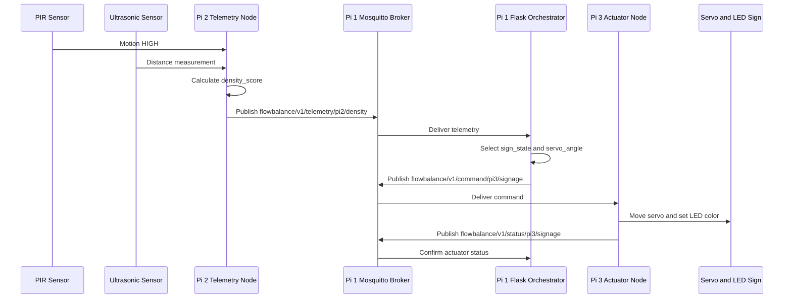

# FlowBalance Engineering Documentation and Implementation Guide

## System Overview

FlowBalance is a decentralized IoT network appliance designed for a university networking module. It uses physical telemetry sensors to estimate crowd density and dynamically actuates physical wayfinding signs across segmented network subnets.

The design uses three Raspberry Pi 4 devices, one Wi-Fi 6 router, Eclipse Mosquitto for MQTT messaging, and a Flask-based core service for orchestration and monitoring.

## Architecture Constraints

### Hardware

Only the following hardware is used:

- 1x Wi-Fi 6 Router
- 3x Raspberry Pi 4 running standard Raspberry Pi OS
- Pi 1, Central Orchestrator: no physical sensors
- Pi 2, Telemetry Node: 1x PIR Sensor, HC-SR501; 1x Ultrasonic Sensor
- Pi 3, Actuator Node: 1x Servo Motor, 2.5V-5V; 1x Multicolor LED, Red/Yellow/Green

### Network Topology

The system uses segmented MQTT communication:

- Subnet 10, Telemetry: Pi 2 lives here and acts as a publisher.
- Subnet 20, Core: Pi 1 lives here and runs Eclipse Mosquitto plus Flask.
- Subnet 30, Actuation: Pi 3 lives here and acts as a subscriber.

Direct communication between Pi 2 and Pi 3 should be blocked. All coordination must pass through the MQTT broker on Pi 1.

---

## Section 1: Network and Hardware Setup

### IP Allocation Table

| Device                   | Role                               | VLAN/Subnet | Static IP       | Subnet Mask     | Default Gateway |
| ------------------------ | ---------------------------------- | ----------: | --------------- | --------------- | --------------- |
| Router VLAN 10 Interface | Telemetry Gateway                  |          10 | `192.168.10.1`  | `255.255.255.0` | N/A             |
| Router VLAN 20 Interface | Core Gateway                       |          20 | `192.168.20.1`  | `255.255.255.0` | N/A             |
| Router VLAN 30 Interface | Actuation Gateway                  |          30 | `192.168.30.1`  | `255.255.255.0` | N/A             |
| Pi 2                     | Telemetry Publisher                |          10 | `192.168.10.20` | `255.255.255.0` | `192.168.10.1`  |
| Pi 1                     | MQTT Broker and Flask Orchestrator |          20 | `192.168.20.10` | `255.255.255.0` | `192.168.20.1`  |
| Pi 3                     | Actuator Subscriber                |          30 | `192.168.30.30` | `255.255.255.0` | `192.168.30.1`  |

### Recommended Firewall Policy

| Source        | Destination | Protocol/Port        | Action                 |
| ------------- | ----------- | -------------------- | ---------------------- |
| Pi 2          | Pi 1        | TCP `1883`           | Allow                  |
| Pi 3          | Pi 1        | TCP `1883`           | Allow                  |
| Admin laptop  | Pi 1        | TCP `5000`, TCP `22` | Allow                  |
| Pi 2          | Pi 3        | Any                  | Deny                   |
| Pi 3          | Pi 2        | Any                  | Deny                   |
| Pi 2 and Pi 3 | Internet    | Optional             | Allow only for updates |

### Router Configuration Requirements

The Wi-Fi 6 router should support one of the following:

- VLAN-tagged LAN ports
- Multiple isolated SSIDs mapped to separate subnets
- Static routing with firewall rules between subnets

Minimum routing requirements:

- Subnet 10 must reach Pi 1 on `192.168.20.10:1883`.
- Subnet 30 must reach Pi 1 on `192.168.20.10:1883`.
- Subnet 10 must not directly reach subnet 30.
- Subnet 30 must not directly reach subnet 10.

### GPIO Pinout Wiring Guide: Pi 2 Telemetry Node

| Component         | Signal | Raspberry Pi GPIO | Physical Pin | Notes                          |
| ----------------- | ------ | ----------------: | -----------: | ------------------------------ |
| PIR HC-SR501      | VCC    |               N/A |          `2` | 5V power                       |
| PIR HC-SR501      | GND    |               N/A |          `6` | Ground                         |
| PIR HC-SR501      | OUT    |         GPIO `17` |         `11` | Digital motion signal          |
| Ultrasonic Sensor | VCC    |               N/A |          `4` | 5V power                       |
| Ultrasonic Sensor | GND    |               N/A |          `9` | Ground                         |
| Ultrasonic Sensor | TRIG   |         GPIO `23` |         `16` | Trigger output                 |
| Ultrasonic Sensor | ECHO   |         GPIO `24` |         `18` | Echo input via voltage divider |

Important: If the ultrasonic sensor is HC-SR04-style, its Echo output is 5V. Raspberry Pi GPIO pins are 3.3V only. Use a voltage divider before connecting Echo to GPIO `24`.

Recommended voltage divider:

| Connection        | Resistor |
| ----------------- | -------- |
| Echo to GPIO `24` | `1k ohm` |
| GPIO `24` to GND  | `2k ohm` |

### GPIO Pinout Wiring Guide: Pi 3 Actuator Node

| Component      | Signal     | Raspberry Pi GPIO | Physical Pin | Notes                             |
| -------------- | ---------- | ----------------: | -----------: | --------------------------------- |
| Servo Motor    | Signal     |         GPIO `18` |         `12` | PWM signal                        |
| Servo Motor    | VCC        |               N/A |  External 5V | Recommended external supply       |
| Servo Motor    | GND        |               N/A |   Common GND | Tie external supply GND to Pi GND |
| Multicolor LED | Red        |          GPIO `5` |         `29` | Use current-limiting resistor     |
| Multicolor LED | Yellow     |          GPIO `6` |         `31` | Use current-limiting resistor     |
| Multicolor LED | Green      |         GPIO `13` |         `33` | Use current-limiting resistor     |
| Multicolor LED | Common GND |               N/A |         `34` | Ground                            |

### Actuator State Mapping

| State     | Density Score | Servo Angle | LED Color | Meaning                  |
| --------- | ------------: | ----------: | --------- | ------------------------ |
| `OPEN`    |        `0-39` |     `0 deg` | Green     | Normal flow              |
| `CAUTION` |       `40-69` |    `45 deg` | Yellow    | Moderate crowding        |
| `DIVERT`  |      `70-100` |    `90 deg` | Red       | Congested, redirect flow |

---

## Section 2: MQTT Data Contract Topic Schema

### MQTT Broker

| Field           | Value             |
| --------------- | ----------------- |
| Broker Host     | `192.168.20.10`   |
| Broker Port     | `1883`            |
| Protocol        | MQTT over TCP     |
| Broker Software | Eclipse Mosquitto |

### Topic Schema

| Direction       | Topic                                    | Publisher | Subscriber | Purpose                        |
| --------------- | ---------------------------------------- | --------- | ---------- | ------------------------------ |
| Telemetry       | `flowbalance/v1/telemetry/pi2/density`   | Pi 2      | Pi 1       | Publish fused density score    |
| Heartbeat       | `flowbalance/v1/telemetry/pi2/heartbeat` | Pi 2      | Pi 1       | Indicate telemetry node health |
| Command         | `flowbalance/v1/command/pi3/signage`     | Pi 1      | Pi 3       | Command servo and LED state    |
| Actuator Status | `flowbalance/v1/status/pi3/signage`      | Pi 3      | Pi 1       | Confirm command application    |

### Telemetry Payload: Pi 2 to Pi 1

Topic:

```text
flowbalance/v1/telemetry/pi2/density
```

Payload:

```json
{
  "node_id": "pi2-telemetry-01",
  "timestamp_utc": "2026-06-10T08:30:00Z",
  "pir_motion": true,
  "ultrasonic_distance_cm": 85.4,
  "distance_confidence": 0.92,
  "density_score": 74,
  "sample_window_seconds": 5
}
```

Field definitions:

| Field                    | Type    | Description                             |
| ------------------------ | ------- | --------------------------------------- |
| `node_id`                | String  | Unique telemetry node identifier        |
| `timestamp_utc`          | String  | ISO 8601 UTC timestamp                  |
| `pir_motion`             | Boolean | `true` if PIR detects motion            |
| `ultrasonic_distance_cm` | Number  | Measured distance in centimeters        |
| `distance_confidence`    | Number  | Confidence from `0.0` to `1.0`          |
| `density_score`          | Integer | Fused score from `0` to `100`           |
| `sample_window_seconds`  | Integer | Sampling interval used for this reading |

### Heartbeat Payload: Pi 2 to Pi 1

Topic:

```text
flowbalance/v1/telemetry/pi2/heartbeat
```

Payload:

```json
{
  "node_id": "pi2-telemetry-01",
  "timestamp_utc": "2026-06-10T08:30:00Z",
  "status": "online",
  "uptime_seconds": 3600
}
```

### Command Payload: Pi 1 to Pi 3

Topic:

```text
flowbalance/v1/command/pi3/signage
```

Payload:

```json
{
  "command_id": "cmd-20260610-083000-001",
  "target_node_id": "pi3-actuator-01",
  "timestamp_utc": "2026-06-10T08:30:01Z",
  "density_score": 74,
  "sign_state": "DIVERT",
  "servo_angle": 90,
  "led_color": "RED",
  "reason": "density_score_above_threshold"
}
```

Allowed command values:

| Field         | Allowed Values              |
| ------------- | --------------------------- |
| `sign_state`  | `OPEN`, `CAUTION`, `DIVERT` |
| `servo_angle` | `0`, `45`, `90`             |
| `led_color`   | `GREEN`, `YELLOW`, `RED`    |

### Actuator Status Payload: Pi 3 to Pi 1

Topic:

```text
flowbalance/v1/status/pi3/signage
```

Payload:

```json
{
  "node_id": "pi3-actuator-01",
  "timestamp_utc": "2026-06-10T08:30:02Z",
  "last_command_id": "cmd-20260610-083000-001",
  "servo_angle": 90,
  "led_color": "RED",
  "status": "applied"
}
```

---

## Section 3: Software Architecture and Logic Flow

### Pi 2 Procedural Telemetry Flow

The Pi 2 script should follow a simple procedural loop:

1. Import standard libraries and dependencies.
2. Define constants for GPIO pins, MQTT broker address, and publish intervals.
3. Define helper functions for:
   - GPIO setup
   - PIR reading
   - ultrasonic distance measurement
   - density score calculation
   - MQTT connection
   - telemetry publishing
   - heartbeat publishing
4. Initialize GPIO.
5. Connect to MQTT broker at `192.168.20.10:1883`.
6. Enter a `while True` loop.
7. Read PIR motion state.
8. Trigger ultrasonic measurement.
9. Calculate fused density score.
10. Publish JSON telemetry every `5` seconds.
11. Publish heartbeat every `10` seconds.
12. Retry MQTT connection if disconnected.

### Pi 1 Procedural Orchestration Flow

Pi 1 runs the broker and an orchestration process:

1. Start Eclipse Mosquitto.
2. Start Flask web server on port `5000`.
3. Connect orchestration worker to local MQTT broker.
4. Subscribe to `flowbalance/v1/telemetry/pi2/density`.
5. Subscribe to `flowbalance/v1/telemetry/pi2/heartbeat`.
6. Convert incoming density scores into actuator commands.
7. Publish commands to `flowbalance/v1/command/pi3/signage`.
8. Track Pi 2 heartbeat freshness.
9. Track Pi 3 actuator status.

### Pi 3 Procedural Actuator Flow

The Pi 3 script should follow a subscriber-driven loop:

1. Import standard libraries and dependencies.
2. Define constants for GPIO pins, servo PWM values, and MQTT broker address.
3. Define helper functions for:
   - GPIO setup
   - LED control
   - servo angle control
   - MQTT connection
   - command parsing
   - actuator status publishing
4. Initialize GPIO and PWM.
5. Connect to MQTT broker at `192.168.20.10:1883`.
6. Subscribe to `flowbalance/v1/command/pi3/signage`.
7. Enter a `while True` loop using MQTT network processing.
8. On each command message:
   - Parse JSON.
   - Validate `servo_angle`.
   - Validate `led_color`.
   - Move servo.
   - Set LED color.
   - Publish actuator status.

### Sensor Fusion Algorithm

The density score combines PIR motion detection and ultrasonic proximity into one score from `0` to `100`.

#### Input Signals

| Signal              | Type    | Meaning                                                 |
| ------------------- | ------- | ------------------------------------------------------- |
| PIR motion          | Boolean | Detects whether movement exists in the monitored area   |
| Ultrasonic distance | Number  | Estimates how close the nearest obstruction or crowd is |

#### PIR Score

```text
pir_score = 100 if motion detected else 0
```

#### Distance Score

The distance score maps closer objects to higher density:

```text
if distance_cm >= 200:
    distance_score = 0
elif distance_cm <= 40:
    distance_score = 100
else:
    distance_score = ((200 - distance_cm) / 160) * 100
```

#### Final Density Score

```text
density_score = (0.35 * pir_score) + (0.65 * distance_score)
density_score = clamp(round(density_score), 0, 100)
```

#### Rationale

PIR detection is useful for identifying movement, but it cannot estimate the number of people or how close they are. Ultrasonic sensing provides a continuous distance measurement and therefore receives a higher weighting. The PIR signal still contributes meaningfully because it reduces false "empty corridor" assumptions when people are moving outside the direct ultrasonic cone.

#### Example Calculation

```text
PIR motion: true
Distance: 80 cm

pir_score = 100
distance_score = ((200 - 80) / 160) * 100
distance_score = 75

density_score = (0.35 * 100) + (0.65 * 75)
density_score = 83.75

final density_score = 84
```

### Command Decision Logic

```text
if density_score >= 70:
    sign_state = "DIVERT"
    servo_angle = 90
    led_color = "RED"
elif density_score >= 40:
    sign_state = "CAUTION"
    servo_angle = 45
    led_color = "YELLOW"
else:
    sign_state = "OPEN"
    servo_angle = 0
    led_color = "GREEN"
```

### Mermaid Sequence Diagram



---

## Section 4: Environment and Dependencies

### Pi 1 Eclipse Mosquitto Installation

Run on Pi 1:

```bash
sudo apt update
sudo apt install -y mosquitto mosquitto-clients python3-pip python3-venv
sudo systemctl enable mosquitto
sudo systemctl start mosquitto
sudo systemctl status mosquitto
```

### Mosquitto Listener Configuration

Create a FlowBalance Mosquitto configuration file:

```bash
sudo nano /etc/mosquitto/conf.d/flowbalance.conf
```

Add:

```conf
listener 1883 0.0.0.0
allow_anonymous true
```

Restart Mosquitto:

```bash
sudo systemctl restart mosquitto
```

Verify that Mosquitto is listening:

```bash
sudo ss -tulpen | grep 1883
```

Security note: anonymous MQTT is acceptable only for a closed lab demonstration network. For production-like hardening, configure username/password authentication and topic-level ACLs.

### Python Runtime Setup

Run on each Raspberry Pi:

```bash
sudo apt update
sudo apt install -y python3-pip python3-venv
mkdir -p ~/flowbalance
cd ~/flowbalance
python3 -m venv .venv
source .venv/bin/activate
```

### `requirements.txt`

Create the following `requirements.txt` on each Pi:

```txt
paho-mqtt==2.1.0
Flask==3.0.3
RPi.GPIO==0.7.1
```

Install dependencies:

```bash
pip install -r requirements.txt
```

### Service Ports

| Service   | Host    |   Port | Purpose        |
| --------- | ------- | -----: | -------------- |
| Mosquitto | Pi 1    | `1883` | MQTT broker    |
| Flask     | Pi 1    | `5000` | Dashboard/API  |
| SSH       | All Pis |   `22` | Administration |

---

## Section 5: Comprehensive Testing Matrix

### Procedural Logic Tests

| Test Case                    | Method                             | Expected Result                     |
| ---------------------------- | ---------------------------------- | ----------------------------------- |
| PIR false, distance `200 cm` | Call fusion function directly      | Density score is `0`                |
| PIR true, distance `200 cm`  | Call fusion function directly      | Density score is `35`               |
| PIR false, distance `40 cm`  | Call fusion function directly      | Density score is `65`               |
| PIR true, distance `40 cm`   | Call fusion function directly      | Density score is `100`              |
| Distance below `40 cm`       | Clamp test                         | Density never exceeds `100`         |
| Distance above `200 cm`      | Clamp test                         | Density never drops below `0`       |
| Distance sensor timeout      | Simulated timeout                  | `distance_confidence` becomes `0.0` |
| Invalid distance value       | Pass negative or `None` equivalent | Function returns safe fallback      |

### Example Logic Test Inputs

| PIR Motion | Distance CM | Expected Density |
| ---------- | ----------: | ---------------: |
| `false`    |       `250` |              `0` |
| `false`    |       `200` |              `0` |
| `true`     |       `200` |             `35` |
| `false`    |       `120` |             `33` |
| `true`     |       `120` |             `68` |
| `false`    |        `40` |             `65` |
| `true`     |        `40` |            `100` |

### Integration Tests

| Test                                 | Command                                                                                                          | Expected Result                                 |
| ------------------------------------ | ---------------------------------------------------------------------------------------------------------------- | ----------------------------------------------- |
| Subscribe to all FlowBalance traffic | `mosquitto_sub -h 192.168.20.10 -t 'flowbalance/v1/#'`                                                           | Telemetry, commands, and status messages appear |
| Subscribe to telemetry               | `mosquitto_sub -h 192.168.20.10 -t 'flowbalance/v1/telemetry/pi2/density'`                                       | Pi 2 payloads appear every `5` seconds          |
| Subscribe to heartbeat               | `mosquitto_sub -h 192.168.20.10 -t 'flowbalance/v1/telemetry/pi2/heartbeat'`                                     | Pi 2 heartbeat appears every `10` seconds       |
| Publish mock telemetry               | `mosquitto_pub -h 192.168.20.10 -t flowbalance/v1/telemetry/pi2/density -m '{"density_score":80}'`               | Pi 1 generates `DIVERT` command                 |
| Subscribe to commands                | `mosquitto_sub -h 192.168.20.10 -t 'flowbalance/v1/command/pi3/signage'`                                         | Command payload appears                         |
| Mock actuator command                | `mosquitto_pub -h 192.168.20.10 -t flowbalance/v1/command/pi3/signage -m '{"servo_angle":90,"led_color":"RED"}'` | Pi 3 moves servo and LED turns red              |
| Verify actuator feedback             | `mosquitto_sub -h 192.168.20.10 -t 'flowbalance/v1/status/pi3/signage'`                                          | Pi 3 publishes `status: applied`                |

### Network Boundary Tests

| Test                             | Source | Command                     | Expected Result |
| -------------------------------- | ------ | --------------------------- | --------------- |
| Pi 2 reaches broker              | Pi 2   | `ping 192.168.20.10`        | Success         |
| Pi 3 reaches broker              | Pi 3   | `ping 192.168.20.10`        | Success         |
| Pi 2 reaches MQTT                | Pi 2   | `nc -vz 192.168.20.10 1883` | Success         |
| Pi 3 reaches MQTT                | Pi 3   | `nc -vz 192.168.20.10 1883` | Success         |
| Pi 2 cannot bypass broker        | Pi 2   | `ping 192.168.30.30`        | Blocked         |
| Pi 3 cannot bypass broker        | Pi 3   | `ping 192.168.10.20`        | Blocked         |
| Pi 2 cannot access actuator SSH  | Pi 2   | `nc -vz 192.168.30.30 22`   | Blocked         |
| Pi 3 cannot access telemetry SSH | Pi 3   | `nc -vz 192.168.10.20 22`   | Blocked         |

### Fault Tolerance Tests

| Fault                      | Detection Method                             | Expected System Behavior                    |
| -------------------------- | -------------------------------------------- | ------------------------------------------- |
| Pi 2 disconnects           | Missing heartbeat for more than `30` seconds | Pi 1 marks telemetry stale                  |
| Pi 3 disconnects           | Missing actuator status after command        | Pi 1 shows actuator offline or unconfirmed  |
| MQTT broker restarts       | Paho reconnect loop                          | Pi 2 and Pi 3 reconnect automatically       |
| Invalid JSON payload       | JSON parse exception                         | Drop message and log error                  |
| Missing payload field      | Validation failure                           | Ignore unsafe command or telemetry          |
| Ultrasonic timeout         | Echo wait timeout                            | Publish `distance_confidence: 0.0`          |
| Servo command out of range | Range validation                             | Reject command and keep previous safe state |

### Heartbeat and Keep-Alive Concept

Pi 2 publishes a heartbeat every `10` seconds:

```text
flowbalance/v1/telemetry/pi2/heartbeat
```

Pi 1 records the latest heartbeat timestamp as `last_seen_pi2`.

If Pi 1 does not receive a heartbeat for more than `30` seconds, it should publish a safe fallback command:

```json
{
  "command_id": "cmd-fallback-pi2-timeout",
  "target_node_id": "pi3-actuator-01",
  "timestamp_utc": "2026-06-10T08:31:00Z",
  "density_score": null,
  "sign_state": "CAUTION",
  "servo_angle": 45,
  "led_color": "YELLOW",
  "reason": "telemetry_node_timeout"
}
```

Optional UDP keep-alive concept:

- Pi 2 sends a UDP heartbeat packet to Pi 1 every `10` seconds.
- Pi 1 treats MQTT heartbeat as authoritative.
- UDP heartbeat is only used as a secondary diagnostic signal.
- MQTT heartbeat remains the primary control-plane health check.

---

## Section 6: Deployment Run Book

### Phase 1: Configure Router

1. Create VLAN or subnet 10:

   ```text
   Network: 192.168.10.0/24
   Gateway: 192.168.10.1
   Purpose: Telemetry
   ```

2. Create VLAN or subnet 20:

   ```text
   Network: 192.168.20.0/24
   Gateway: 192.168.20.1
   Purpose: Core
   ```

3. Create VLAN or subnet 30:

   ```text
   Network: 192.168.30.0/24
   Gateway: 192.168.30.1
   Purpose: Actuation
   ```

4. Assign Pi 2 to subnet 10.

5. Assign Pi 1 to subnet 20.

6. Assign Pi 3 to subnet 30.

7. Configure firewall rules:

   ```text
   Allow 192.168.10.20 -> 192.168.20.10 TCP 1883
   Allow 192.168.30.30 -> 192.168.20.10 TCP 1883
   Deny 192.168.10.0/24 -> 192.168.30.0/24 any
   Deny 192.168.30.0/24 -> 192.168.10.0/24 any
   ```

### Phase 2: Configure Static IPs

Run on each Raspberry Pi:

```bash
sudo nmtui
```

Set each Pi according to the allocation table:

| Device | Static IP          | Gateway        |
| ------ | ------------------ | -------------- |
| Pi 2   | `192.168.10.20/24` | `192.168.10.1` |
| Pi 1   | `192.168.20.10/24` | `192.168.20.1` |
| Pi 3   | `192.168.30.30/24` | `192.168.30.1` |

Reboot each Pi:

```bash
sudo reboot
```

### Phase 3: Install Pi 1 Core Services

Run on Pi 1:

```bash
sudo apt update
sudo apt install -y mosquitto mosquitto-clients python3-pip python3-venv
sudo systemctl enable mosquitto
sudo systemctl start mosquitto
```

Create the Mosquitto config:

```bash
sudo nano /etc/mosquitto/conf.d/flowbalance.conf
```

Add:

```conf
listener 1883 0.0.0.0
allow_anonymous true
```

Restart:

```bash
sudo systemctl restart mosquitto
sudo systemctl status mosquitto
```

### Phase 4: Prepare Python Environment on All Pis

Run on Pi 1, Pi 2, and Pi 3:

```bash
mkdir -p ~/flowbalance
cd ~/flowbalance
python3 -m venv .venv
source .venv/bin/activate
pip install -r requirements.txt
```

### Phase 5: Start Pi 1 Orchestrator

Run on Pi 1:

```bash
cd ~/flowbalance
source .venv/bin/activate
python3 orchestrator.py
```

Expected output:

```text
MQTT connected to 192.168.20.10:1883
Flask dashboard listening on 0.0.0.0:5000
Subscribed to flowbalance/v1/telemetry/pi2/density
Subscribed to flowbalance/v1/telemetry/pi2/heartbeat
```

### Phase 6: Start Pi 3 Actuator Node

Run on Pi 3:

```bash
cd ~/flowbalance
source .venv/bin/activate
python3 actuator_node.py
```

Expected output:

```text
Connected to broker 192.168.20.10
Subscribed to flowbalance/v1/command/pi3/signage
Servo initialized on GPIO 18
LED pins initialized
```

### Phase 7: Start Pi 2 Telemetry Node

Run on Pi 2:

```bash
cd ~/flowbalance
source .venv/bin/activate
python3 telemetry_node.py
```

Expected output:

```text
Connected to broker 192.168.20.10
Publishing telemetry every 5 seconds
Publishing heartbeat every 10 seconds
```

### Phase 8: Verify End-to-End Messaging

Run on Pi 1:

```bash
mosquitto_sub -h 192.168.20.10 -t 'flowbalance/v1/#'
```

Trigger the demo by walking in front of the Pi 2 sensors.

Expected sequence:

1. Pi 2 publishes increased `density_score`.
2. Pi 1 receives telemetry.
3. Pi 1 publishes signage command.
4. Pi 3 moves servo.
5. Pi 3 LED changes green, yellow, or red.
6. Pi 3 publishes actuator status confirmation.

### Phase 9: Live Demonstration Script

Use this script to explain the system during demonstration:

```text
FlowBalance demonstrates segmented IoT networking where telemetry and actuation nodes cannot directly communicate.

Pi 2 collects physical sensor data in the telemetry subnet and publishes MQTT telemetry to the broker in the core subnet.

Pi 1 receives the telemetry, calculates the appropriate wayfinding state, and publishes a command.

Pi 3 receives the command in the actuation subnet and physically changes the wayfinding sign using a servo and LED.

All coordination is mediated through the MQTT broker and orchestration service, enforcing subnet separation while enabling real-time physical response.
```

---

## Appendix A: Suggested Repository Layout

```text
flowbalance/
  README.md
  requirements.txt
  orchestrator.py
  telemetry_node.py
  actuator_node.py
  tests/
    test_sensor_fusion.py
    test_command_mapping.py
```

## Appendix B: Key Operational Defaults

| Setting                   | Value           |
| ------------------------- | --------------- |
| Telemetry interval        | `5` seconds     |
| Heartbeat interval        | `10` seconds    |
| Telemetry stale threshold | `30` seconds    |
| MQTT broker               | `192.168.20.10` |
| MQTT port                 | `1883`          |
| Flask port                | `5000`          |
| Normal threshold          | `0-39`          |
| Caution threshold         | `40-69`         |
| Divert threshold          | `70-100`        |
